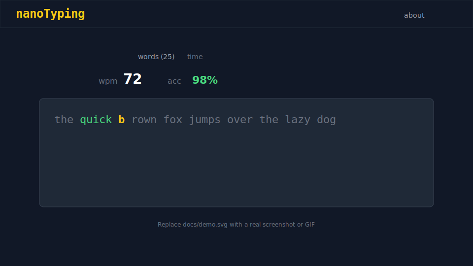

# nanoTyping

[](https://github.com/naodmulu/nanoTyping-web/actions/workflows/ci.yml)

A minimalist typing-speed test with character-by-character feedback, live WPM/accuracy,
and sliding-window rendering that keeps long passages smooth.

**Live demo:** [nano-typing-web.vercel.app](https://nano-typing-web.vercel.app/)



---

## Why this project

Most typing-test UIs are straightforward forms. nanoTyping's interesting part is the
**rendering pipeline**: only ~6 visible lines mount at a time instead of thousands of
character spans, with runtime DOM measurement and an O(1) keystroke stats path.

The full engineering story — diagrams, file references, and benchmark numbers — is in
**[DESIGN.md](./DESIGN.md)**. That's the document to read before an interview.

---

## Features

- **Word-count mode** — 10 / 25 / 50 / 100 words, auto-finish on completion
- **Timed mode** — 15 / 30 / 60 / 120 seconds with live countdown
- **Live stats** — corrected WPM, raw WPM, accuracy (color-coded)
- **Character feedback** — per-char correct / wrong coloring + caret highlight
- **Pause / resume** — Esc to toggle; auto-pause after 15 s idle
- **Result modal** — WPM, accuracy, errors, time on finish
- **CI-gated quality** — lint, typecheck, and tests on every PR

### Roadmap (not yet shipped)

- Punctuation / numbers / quote modes (UI stubs exist)
- `GET /api/words` backend with caching
- Session history (localStorage → Supabase)
- IME composition + mobile on-screen keyboard support

See [DESIGN.md — Known limitations](./DESIGN.md#known-limitations--future-work) for details.

---

## Architecture (30-second version)

```
keystroke → running counters (O(1)) → live stats (rAF timer)
                ↓
         charStates (render only)
                ↓
    word boundaries → DOM line measure → visible window → ~6 lines of spans
```

Deep dive: **[DESIGN.md](./DESIGN.md)**

Key files:

| Concern | Location |
|---------|----------|
| Virtualization + measurement | `app/layout/body/components/TypingBox.tsx` |
| Window / binary search | `app/utils/textWindow.ts` |
| O(1) counters | `app/utils/typingCounters.ts` |
| rAF session timer | `app/hooks/useSessionTimer.ts` |
| Visible text slice | `app/ui/RenderText.tsx` |

---

## Tech stack

- **Next.js 16** (App Router) · **React 19** · **TypeScript**
- **Tailwind CSS 3**
- **Vitest** + **React Testing Library**
- **GitHub Actions** CI
- Deployed on **Vercel**

---

## Local development

```bash
git clone https://github.com/naodmulu/nanoTyping-web.git
cd nanoTyping-web
npm ci
npm run dev
```

Open [http://localhost:3000](http://localhost:3000). Click the typing area (or Tab to
it) and start typing.

No environment variables required for the current frontend-only build.

---

## Testing

```bash
npm test          # Vitest unit + integration suite
npm run test:watch
npm run coverage
npm run bench     # O(1) vs O(n) keystroke benchmark (see DESIGN.md)
npm run typecheck
npm run lint
npm run build     # production build
```

### CI

Every push to `main` and every PR runs [`.github/workflows/ci.yml`](.github/workflows/ci.yml):
`npm ci` → `lint` → `typecheck` → `test`.

### Accessibility

Quick wins shipped for v1:

- Visible `:focus-visible` ring on the typing area and option controls
- Skip-to-main-content link in the header
- `prefers-reduced-motion`: caret scroll uses instant jump instead of smooth scroll

**Known gaps** (documented, not half-built): IME composition, mobile hidden-input focus.
Lighthouse accessibility score on production build: **96/100** (local `npm run build &&
npm run start`, then `npx lighthouse http://localhost:3000 --only-categories=accessibility`).
See [DESIGN.md](./DESIGN.md#known-limitations--future-work).

---

## License

MIT — see repository for details.
